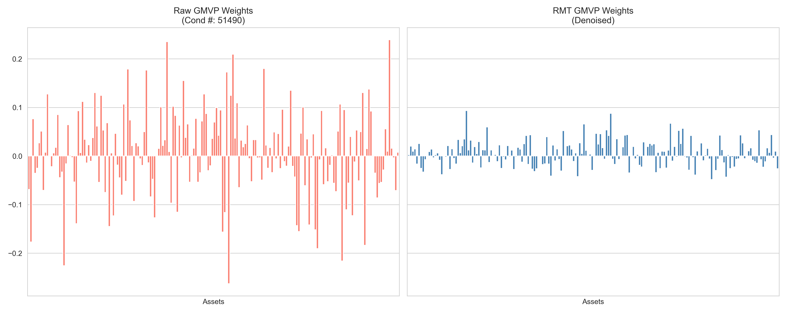
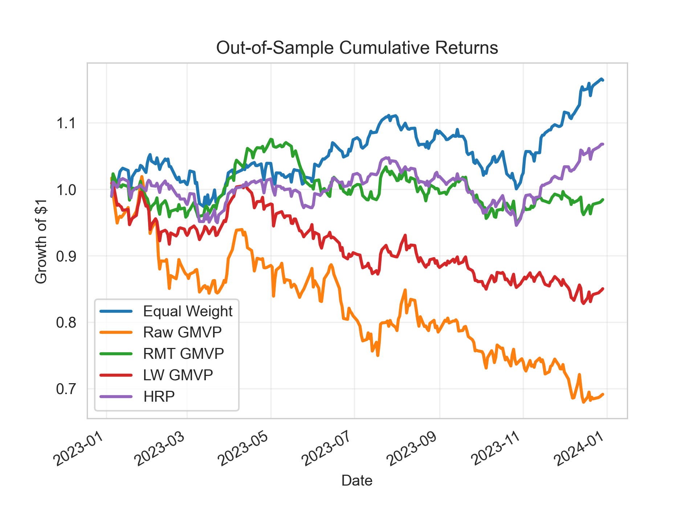

# SpectraPort: RMT & HRP Portfolio Optimization


**SpectraPort** 是一個量化資產配置研究框架，旨在解決高維度金融數據中的「維度災難」與「雜訊過擬合」問題。

本專案實證比較了 **隨機矩陣理論 (RMT)**、**Ledoit-Wolf 收縮** 與 **階層風險平價 (HRP)** 在 S&P 500 成分股上的樣本外績效。

## 🚀 Key Findings (核心發現)

基於 2021-2023 年的滾動回測數據 (Rolling Window Backtest)：

1.  **物理去噪的威力**: 
    原始矩陣優化 (Raw GMVP) 由於過度擬合雜訊，導致年化波動率高達 **23.19%** 並嚴重虧損。經過 **RMT (Random Matrix Theory)** 去噪後，波動率大幅下降至 **12.41%**，成功修復了病態矩陣。

2.  **機器學習的防禦性**:
    **HRP (Hierarchical Risk Parity)** 演算法透過層次分群結構，在不依賴矩陣求逆的情況下，實現了最低的波動率 (**10.70%**) 與正向報酬，展現了最佳的穩健性 (Robustness)。

## 📊 Performance Matrix

| Strategy | Annual Return | Volatility | Sharpe Ratio | Max Drawdown |
|----------|---------------|------------|--------------|--------------|
| **Equal Weight** | 16.22% | 12.31% | 1.32 | -9.96% |
| **Raw GMVP** | **-34.80%** | **23.19%** | -1.50 | -33.35% |
| **RMT GMVP** | **-0.83%** | **12.41%** | -0.07 | -11.89% |
| **LW GMVP** | -15.45% | 14.26% | -1.08 | -18.01% |
| **HRP** | **7.26%** | **10.70%** | **0.68** | **-9.73%** |

> *註：GMVP 採用無限制 (Unconstrained) 模型以凸顯原始矩陣的不穩定性。Raw GMVP 的鉅額虧損來自於極端槓桿與放空，而 RMT 成功緩解了此現象。*

## 📈 Visualizations

### 1. 權重穩定性比較
左圖為原始矩陣優化結果，可見權重極度發散（過度放空/做多）；右圖為 RMT 去噪後結果，權重顯著收斂，回歸理性配置。



### 2. 樣本外累積報酬
HRP 展現了最平滑的淨值曲線，證明了其在市場震盪期間的抗跌能力。



## 🛠️ Usage

1. **Install Dependencies**
   ```bash
   pip install -r requirements.txt
   ```
2. **Run Analysis**
    ```Bash
    python main.py
    ```
    程式將自動下載數據、執行 RMT 頻譜分析、進行滾動回測，並將結果圖表儲存至 images/ 資料夾。

## 📂 Project Structure
- src/denoise.py : 實作 Marchenko-Pastur 分佈擬合與特徵值裁剪。

- src/clustering.py : 實作 Hierarchical Clustering 與矩陣重排。

- src/optimization.py : 實作 Markowitz Mean-Variance 與 HRP 優化器。

- src/backtest.py : 實作 Rolling Window Out-of-Sample Validation。

## 🧠 Theory
- Random Matrix Theory (RMT) : 利用 $\lambda_{max} = \sigma^2(1+\sqrt{N/T})^2$ 濾除雜訊特徵值。

- Hierarchical Risk Parity (HRP) : 利用 Graph Theory 與 Recursion 解決矩陣求逆的不穩定性問題。

Created by Willy Tsai